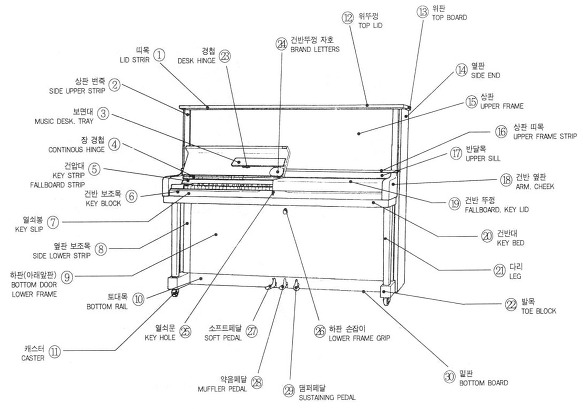
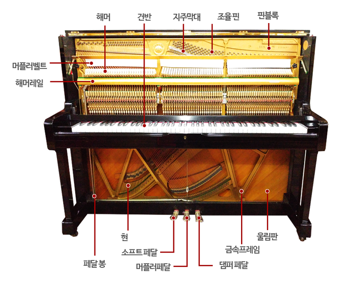
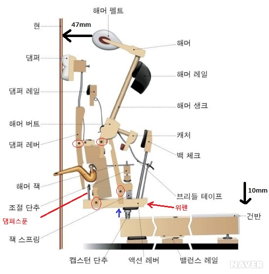
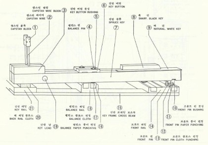

# 피아노 품질의 조건
## 음률(Pitch): 음악에서 사용하는 음높이의 상호관계를 음악적, 수학적으로 확정한것.
## 음색(Voice): 음의 성분의 차이 
  - 현의 재질
  - Hammer의 경도, 형태
  - 브릿지, 향판, 향봉의 재질
# 터치(Touch)
- 스프링의 강도, 액션자체의 중량, 건반중량, 센터핀의 원활성이 터치와 밀접한 관계가 있다.

# 피아노 품질 유지
 - 조율: 현의 장력을 가감하여 바른음을 만드는 작업
 - 정음: 피아노가 갖추어야 할 음색을 유지시켜 주는 작업
    - 침질하기 (Needling)
    - 갈아주기 (Filing)
    - 도핑 (Doping)
 - 조정: 타현기구의 동작상태를 원활하도록 하는 작업
 - 보호 및 수리

# 피아노 요소
  - 설계
  - 재료
    - 목재: 자연건조(seasoning) + 인공건조(최종 함수율 5~10%)
    - 금속
    - 섬유
      - 펠트(Felt) 양모(해머)
      - 크로스(Cloth), 주로 마찰하는 영역(현의 울림 소리외 제거)
    - 기계, 설비
    - 기술자 

# 음향판
1. 브릿지(Bridge): 비중이 큰나무
- 현의 진동을 향판에 전달하는 매개체.
- 재질은 음량과 관계가 깊다. (고로쇠, 나토박)
- 저음부는 짧고 (단브릿지), 고음부는 길다.(장브릿지)
- 폭 약 35mm 두께 약 30mm
- 현의 베어링 역활
  - 브릿지 높이: 고음부 1.5mm 저음부 3.5 ~ 4mm(상하굴절)
  - 브맂지 핀: 좌우굴절 (Side bearing)
- Cut bridge: 브릿지와 힘살대가 닿는 부분을 도려 냄(음량을 떨어뜨리는 경향, 향판과 현에만 접촉)
- Ring bridge: 그랜드피아노의 장, 단 브릿지를 연결하는 고리모양.
- 연장식 또는 현수식 연결법(Suspending system): 저음브릿지의 위치를 좌판을 이용하여 향판의 중심부로 이동시킨 장치, p.45 cf

2. 향판(Sound board) P.21
- 현의 소리를 증폭, 확대
- 판의 두께: 고음부 9 ~ 10mm, 저음부 7 ~ 8mm
- 나무결은 비스듬히 접착한다.
- 조화장치(Hamonic trap): 향판의 상하 모퉁이에 딱딱한 재질의 목재를 부착시켜 불필요한 진동을 없앤다.
- 스프루스가 갖추어야 할 조건
  - 건조상태 할수율 6% 이내 
  - 정목제재한다.
  - 나무간격이 치밀하고 직선
  - 옹이가 없고 부식이 없어야 한다.
- 향판의 크라운(Crown)현상
  - 현의 하압력에 대항하여 음을 확대, 증폭 하기 위하여 향판의 중앙쪽이 프레임을 향하여 10mm 튀어나온 상태

3. 향봉
- 수량 10 ~ 13개
- 스프루스 사용, 정목제재
- 향판의 나무결과 90도 직각되게 접착한다.
- 끝부분은 자유로운 진동을 위하여 가늘게 만든다.
- 역활
  - 향판의 Crown 상태를 만든다.
  - 현의 진동을 빠리 횡적으로 전달한다.
  - 현의 하압력에 대항한다.

# 업라이트 피아노 구조
## 외부 구조
- 
## 내부 구조
- 
## 액션
- 
## 건반
- 

6. 조율핀과 핀판(p.25)
- 표준형 
  - 지름 6.95 +- 0.05mm
  - 박히는 부분 35 +- 1mm
  - 전체길이 60 ~ 64mm
- Over size 
  - 조율핀 교환시 사용
  - 굴기 7.2 +- 0.05mm
- 박히는 부분은 세밀한 나사산 가공
- 우드부싱(Wood bushing)
  - 조율핀과 철골 사이에 끼워진 링모양의 쐐기(고로쇠, 나토박)
- 점핑핀(Jumping pin)
  - 조율핀의 비약적인 회선상태, 점핑원인은 핀판의 구멍이 너무 작거나 기름기가 묻어 있을때
- 토르크(Torque: 회전 점력)
  - 현의 장력에 의하여 조율핀이 원위치로 돌아가려는 힘을 억제하는 것.
  - 토르크 효과
    - 단단한 복수종횡으로 만들어진 핀판
    - 우드부싱
    - 나사산이 정밀할때 효과 큼

7. 핀판(Pin block, Wrest plank) p.26
- 조율핀을 정확, 견고하게 유지시켜야 함.
- 철골과 정확, 견고하게 밀착되어야 함
- 경도가 높은 목재를 복수 종횡으로 가공
- 뒤틀림 갈라짐 방지
- 폭 18cm 두꼐 6cm
- 재료: 고로쇠, 나토박 등 단단한 목재

## 피아노 발달사 암기
- 1709년 크리스토 포리 피아노 발명
- 칙카링 총철골 발명(1840)
- 호킨스 업라이트 피아노 발명(1800)
- 라우드 교차식현 특허(1802)

# 타현기구
  - 액션레일(액션에 있는 레일)
  - 해머헤드와 바트(해머 중요하지)
  - 위펜(헤머 아래 위펜 잭도 붙어 있음)
  - 레규레이팅 버튼(잭의 되돌아가게 해주는 버튼 잭꼬리와 만남)
  - 백첵(해머를 멈추게 해주는 기구 캐처와 세트 벡첵 와이어 조정)
  - 해머레일(해머샹크의 뒤져짐이나 잡음을 방지, 펠트가 붙어 있음)
  - 댐퍼(현의 진동을 멈추게 하는 기구)
  - 센터핀(우드 부싱 교체보다 센퍼핀 교환이 수월)
    - 핀의 길이는 18 ~ 20mm 
    - 센터핀 19 번 1.2mm 반번호당 0.025mm 차이(암기 p.29)

# 해머 되돌림 촉진
  - 브라이들 테이프
  - 바트 스프링
  - 샹크 경사각 3도

# 해머 흔들림 
  - 플랜지 나사
  - 플레이트 스크류
  - 센터핀

# Let off
  - 잭머리 끝이 Butt 밑에서 빠져 나오는 현상
  - 해머가 현의 진동을 방해하지 않기 위함
  - 잭이 바트 빝에서 빠져 나오면서 해머는 모든 힘을 잃어 버린다는 의미에서 탈진(escapement)현상이라고도 불림
  - 건반을 서서히 눌러 해머의 진행 상태를 보면서 해머 선단이 현앞 2 ~ 3mm(암기) 접근할떄 발생
  - 레규레이팅 버튼을 돌려 조정(가까우면 오른쪽, 멀면 왼쪽)

# Let off와 음의 관계
  - Let off 일찍 일어날때 or 거리가 멀때 즉 버튼을 올린다.
    - 타현력 약화
    - 터치가 무거워진다.(고객 취향)
  - Let off 늦게 일어날때 or 거리가 가까울때 즉 버튼을 내린다.
    - 현진동 방해하여 막힌음 발생(떵 거리는 소리들)

# 액션의 정상운동 p.38
1. 극히 느린 타건의 경우(댐퍼, 렛오프 거리 조정)
- 건방하향
- 건반후단 상승
- 캡스턴 위펜 들어 올림
- 잭상승
- 해머 전진
- 해머전진 18 ~ 22mm(암기) 일때 댐퍼 스푼이 댐퍼 레버를 밀어 댐퍼 뜨게 한다.(댐퍼 작동)
- 해머가 현 앞 2 ~ 3mm(암기) 접근시 레규레이팅 버튼이 잭꼬리를 눌러 잭머리가 바트 밑에서 빠져나와 해머가 탈진한다.
- 해머 후퇴 
- 원위치

2. 정상타건의 경우
- 렛오프 발생까지 동일
- Let off 발생
- 타현 (탄력으로 인해 현까지 도달함)
- 후퇴
- 해머 정지
  - 타현후 13 ~ 15mm(암기)
  - 백첵이 캐처를 잡아 해머를 정지
- 원위치

## 현 p.14
- 현의 조건
- 현의 재질 검사
- 현의 장력
- 현의 굵기 17.5 1.000 반번호당: 0.025

## 철골 (Iron Frame or Plate) p.16
- 철판의 두께
- 상부브릿지
- 아그라프
- 누름쇠

# 건반
  - 밸런스 핀을 기점으로 지렛대 운동
  - 백건
    - 표면은 아크릴 사용
    - 1개 폭 23.5mm, 7개 옥타브 164.5mm, 전체 약 1,227mm
    - 건반 높이 64mm (건반대로부터)
    - 건반 깊이 9.5mm ~ 10.5mm(암기 10mm 건반자 활용, 높이가 무게감에 영향)
  - 흑건
    - 길이 95mm
    - 폭 11mm (아래면) ~ 9mm(위면)
    - 높이 12mm (전면) ~ 10mm (후면) (12mm 가지런히 정렬)
  - 밸런스 핀 
    - 건반의 회전 중심 3:2 (그네 원리)
    - 밸런스 핀 길이: 48 ~ 52mm
    - 건반 좌우 수평유지(건반이 기울었을때 반대 방향으로 핀 조정)
  - 프런트 핀
    - 건반 전면 간격 유지
    - 건반 안정시킴 (전면 안정, 건반사이의 사이의 간격들 0.2mm)
  - 종이 펀칭
    - 밸런스핀: 건반 높이 조절
    - 프런트핀: 건반 수평 조절
  - Cloth punching: 완충 작용
  - 건반 납: 무게 6 ~ 10g. 건반 무게를 조절하여 Touch의 명확성을 구함

# 페달 p.34 도면 p.58
  - 댐퍼 페달(Damper pedal, Loud pedal) 
    - 오른쪽 페달, 댐퍼를 조절하기 위함
    - 트랩워크
      - 페달을 밟아서 효과를 나타내기까지의 경로
      - 댐퍼 페달 -> 댐퍼페달레버 -> 댐퍼페달봉 -> 댐퍼로드
      - 나비 너트를 통해서 댐퍼의 간격을 조절 가능(언제 떨어지느냐 울림 지속 시간 조정)
  - 소프트 페달(Soft Pedal, Shift Pedal)
    - 업라이트: 해머레일이 현쪽으로 15mm 전진, 타현거리를 짧게하여 타현력을 약하게 함
    - 그랜드: 건반과 액션을 수용한 건반 프레임 전체가 오른쪽으로 3mm 이동하여 3선중 2선만 치게 함.
  - 약음 페달(Muffler Pedal, Silednt Pedal)
    - 해머와 현 사이에 펠트를 끼워 소리를 적게 함.
    - 나비 너트를 통해서 펠트 거리 조정
  - 소스테뉴토 페달(Sostenuto Pedal)
    - 그랜드피아노의 중간페달.
    - 원하는 음만 지속적으로 울림을 얻고 싶을떄 사용.
    - 그랜드 피아노에서는 소스테누토(Sostenuto) 페달이라고 해서 페달을 밟기 직전에 이미 올라가 있는 댐퍼만을 계속 올라가 있게 만든다. 다시 말해, 건반을 누른 상태에서 페달을 밟고 있으면 건반에서 손을 떼어도 소리가 계속 유지되지만, 이미 밟고 난 후에 누른 건반은 유지되지 않는다. 독립적 다성부가 난무하는 곡들을 칠 때 주로 필요하다.

    # 음의 성질
1. 고저 (높낮이, Pitch)
## 현의 진동수에 관한 법칙(메르센느의 법칙)
1. 진동수는 현의 길이에 반비례 한다.
2. 진동수는 현의 굵기에 반비례 한다.
3. 진동수는 현의 장력의 제곱근에 정비례 한다.
4. 진동수는 현의 비중(말도)의 제곱근에 반비례 한다.

1) 현의 굵기, 장력, 비중이 일정하면 현의 길이가 길수록 낮은음
2) 현의 길이, 장력, 비중이 일정하면 굵기가 굵을수록 낮은음
3) 현의 굵기, 길이, 비중이 일정하면 장력이 높을수록 높은음
4) 현의 굵기, 길이, 장력이 일정하면 비중이 클수록 낮은음

# 표준음고(Standard Pitch) p.68
## 음악에서 쓰이는 음 높이를 통일 시키기 위하여 선정된 진동수
1. 19세기 말까지는 시대와 국가에 따라 같지 않다.
2. 1834년 슈트트가르트 회의에서 49라(A) = 440c/s로 결정
  - 표준음고 = 필하모닉 음고 = 연주음고 = 440c/s
3. 1885년 비인 회의에서 49라(A) = 435c/s로 결정 = 국제음고(안쓰임)
4. 음색
5. 소리의 반사, 흡수 회절
  - 벽에 부딪히면 반사되는 성질
  - 벽이나 매질에 흡수되는 현상(고음일수록 흡수가 잘됨)
  - 소리가 좁은 틈이나 장애물의 가장자리를 지날 때 좁은 틈이나 장애물의 가장자리를 돌아서 휘어져 나아가는 현상(저음일수록 잘들림)
6. 음의 공명
  - 발음체가 다른곳에 접촉할때 소리의 울림현상(정수배의 진동수일때 나옴)
7. 음폐효과(Masking effect)
  - 음으로 음을 가린다.
  - 저음의 음폐 효과가 크다.

# 암기
## 소리의 속도 p.65 <각 매질에서 소리의 속도>
- 소리의 속도는 340m/sec 섭씨 15도일때
- 물속에서 4.3배(1470m/sec)
- 동속에서는 10.4배(3500m/sec)
- 스프루스 5500m/sec
## 음의 간섭
- 2개의 서로 다른 음은 서로 간섭하여 으르렁거리게 되는데 이와같이 진동수가 다른음은 서로 간섭하여 맥놀이(Beats)현상이 발생
- 사람이 청각으로 판별할수 있는 능력은 약 30개 전후
## 순음
- 홑진동음(소리굽쇠, 라디오 시보)
## 음의 성질
- 고저(Pitch)
  - 귀로 들을수 있는 범위 16c/s ~ 20,000c/s
  - 피아노 음역은 27.5c/s ~ 4186c/s정도
  - 오르간 16c/s ~ 8,000c/s까지
## 음색(voice)
- 음의 파형에 따라 음 빛깔의 차이로 나타난다.
## 귀의 특성
- 외이
  - 귓바퀴, 귓구멍, 귀청
  - 고막을 진동시키는 역활
- 중이
  - 귓속뼈
    - 방망이뼈, 다듬이뼈, 등자뼈
  - 가운덧귓
  - 고실(공기가 들어 있어 연결하는 공간, 비행기 압력차의 원인, 유스테이시안관)
- 내이
  - 세반고리관
  - 전정기관
  - 달팽이관
  - 기저막에는 신경세포가 있어 소리의 감각을 대뇌에 전달(음의 식별 가능)
- 어지러울때 내과만 가지말고 이빈후과도 가야 한다.
- 귀핀이 빠지면 방책은 딱히 없다.
- 그래도 증상의 원인은 알 수 있다.

## 리듬
- 음악의 토대가 되고 기초를 이루는 가장 중요한 요소
- 일정한 규칙에 지배되는 셈, 여림의 진행
- 변화있는 장단의 진행
- 수평진행의 질서있는 운동

## 멜로디
- 미적, 시간적으로 연속배열한 것
- 높, 낮이의 시간적인 배합
- 음악의 표면이라할 수 있으며 가장 알기 쉽고 감동을 줄 수 있는 힘

## 하모니 
- 높이가 다른 음이 동시에 울리는 것
- 높,낮이의 동시적인 배합
- 음악은 더욱 폭이 넓어지고 깊어지며 풍부

## 기음과 상음
- 홑진동으로 발생하는 음을 기음
- 그 밖의 부분 진동으로 발생하는 음을 상음

## 배음
- 각 상음의 진동수가 기음의 진동수가 정수배가 되는 것을 배음
- 1배음 도일경우
- 2배음 + 7 = 도' (8')
- 3배음 + 12 = 솔' (8 + 완전5도)
- 4배음 + 15 = 도'' (8'')
- 5배음 + 17 = 미'' (8'' + 장3도)
- 6배음 + 19 = 솔'' (8'' + 완전5도)
- 8배음 + 22 = 도''' (8''')
- 10배음 + 24 = 미''' (8''' + 장3도)
- 12배음 + 26 = 솔''' (8''' + 완전 5도)
- [배음현상] https://m.blog.naver.com/PostView.nhn?blogId=bearryu&logNo=30164391112&proxyReferer=https%3A%2F%2Fwww.google.com%2F
### 계산법이 장3도 기준으로 하니까 단위가 유닛당 더해야 함

## 보족음정의 맥놀이와 조율 Test
- 아래가 완전 4도, 위가 완전5도이면 두음정의 맥놀이는 같다.
- 아래가 완전 5도, 위가 완전4도이면 위 음정이 아래음정의 2배 맥놀이
- 아래가 단음정(3,6도), 위가 장음정(6,3도)이면 두음정의 맥놀이는 같다.
- 아래가 장음정(3,5도) 위가 단음정(6,3도)이면 위음정이 아래음정의 2배 맥놀이
- 조율상태를 점걸할떄는 아래, 위 두음정의 맥놀이가 같은 경우만 이용하자.
- 예시1
  - 52번도 64번도일 경우
  - 52번도 57번파 맥놀이가 64번도 57번파 맥놀이와 같다.

  # 음정과 음계

## 음정의 정의
  - 두음 사이의 거리 관계를 음정이라 한다.
  - 거리를 계산하는 단위는 반음

## 음정의 종류
  - 동시에 울리는 두음의 관계를 화성스런 음정.
  - 순차적으로 울리는 두음의 관계를 가락스런 음정
  - 두개의 반음과 다섯개의 온음이 포함된것을 온음계
  - 임시표를 써서 반음 관계로 나열한것은 반음계

## 음정의 변화
  - 완전음정(Peftect Interval)
    - 1,4,5,8
  - 장음정(Major Interval)
    - 2,3,6,7
  - 단음정(Minor Interval)
    - 2,3,6,7
  - 증음정(Argumented Interval)
    - 4도의 예
      - 도파(온음2 반음1개, 미)
      - 레솔(온음2 반음1개, 미)
      - 미라(온음2 반음1개, 미)
      - 파시(온음3)
      - 솔도(온음2 반음1개, 시)
      - 라미(온음2 반음1개, 시)
      - 시레(온음2 반음1개, 시)
        - 여기서 파시 온음3개가 증4도 보통의 4도보다 반음이 높다.
        - 즉 반음 미, 시로 인한 반음 개수의 차이로 파악한다.
  - 감음정(Dinminished Interval)
    - 5도의 경우
      - 도솔(온음3, 반음1개 기준)
      - 시파(온음2, 반음2개, 미,파)
      - 감음정이라고 한다.
        - 반음의 개수 차이를 잘 파악하자.
        - 기준을 도로 잡자.

## 홑음정 과 겹음정
  - 8도안에 드는것 홑음정
  - 8도 보다 넓은것을 겹음정
    - 이는 8도를 빼거나 몇개의 8도를 빼서 계산한다.

## 반음계적 음정
  - 우선 온음계를 측정하고
  - 측정한 온음계를 반음의 개수와 비교한다.
  - 1개 많으면 증, 1개적으면 감
  - 2개 많으면 겹증, 2개 적으면 겹감

## 음정의 자리 바꿈
  - 한복타브 위로 올리거 내린것
  - 보족관계
  - 9 - 원음정
  - 솔도, 도파 파도', 솔미, 미솔, 솔미'
  - 자리 바꿈의 성질
    - 완전음정 <-> 완전음정(완전4도 완전5도 완전4도 형태)
    - 장음정 <-> 단음정(장3도, 단6도, 장3도 형태)
    - 증음정 <-> 감음정(감3도, 증6도, 감3도 형태)
    - 단 겹음정은 자리바꿈 되지 않는다.
      - 그러나 한음 위나 아래로 보고 +-1도 형태로 보면 된다...

## 협화음정과 불협화 음정
  - 어울림 음정
    - 완전 어울림 음정
      - 완전1도
      - 완전4도
      - 완전5도 
      - 완전8도
    - 불완전 어울림 음정
      - 장3도
      - 단3도
      - 장6도
      - 단6도
  - 안어울림 음정
    - 장2도 
    - 단2도
    - 장7도
    - 단7도
    - 증음정
    - 감음정

## 장음계(Major Scale)
  - C음에서 시작하면 3~4번쨰 7번째 8번쨰가 반음으로 구성된 옥타브
  - 테트라코드 도레미파, 솔라시도
    - 2개를 합쳐서 1옥타브 구성
    - 그리스의 음조직

## 단음계(Minor Scale) 
  - C음에서 시작하면 2~3번째 5~6번째가 반음인 음계
  - 장음계 으뜸음의 단3도 아래가 단음계의 의뜸음
    - 장음계 도일 경우 라가 단음계의 으뜸음

## 조바꿈과 조옮김
  - 한때 다른 조로 옮겨진다.
  - 아주 조를 바꾸어 버린다.
  - 조를 아주 바꾸지 않고 다른 조의 음을 빌려쓰는 정도로 그친다.
  - 악고의 어느 부분을 다른 조로 구성한다.
  - 한 조에 머무르지 않고 연속적으로 조바꿈한다.
  - 악보에서 위의 다섯가지 경우를 처리하는 방식
    - 조표는 바꾸지 않고 임시표로 처리한다.
    - 조표를 아주 바꾸어서 쓴다.
  - 조 옮김
    - 지정된 음정을 높이거나 낮추는 경우 이것이 무슨 조에서 무슨조로 옮겨지는가를 살필것.
    - 지정된 조로 조옮김할때 먼저 그 조의 조표를 정확히 적고, 두 조 사이의 으뜸음의 간격을 파악할 것.
    - 변화표에 주의할 것.
      - 조표의 경우 # b뿐아니고 등이 되는 경우가 있다.
      - 즉 원곡에 있어서 조표 떄문에 이미 변화되어 있던 음이 다시 변화한다면 #, bb, 등이 붙을 것이다.
      - 그러나 옮기는 조에서는 그대로 붙지 않을때가 있다.
      - 결국 원조에서 변화된 만큼 옮기는 조에서도 그대로 변화시켜 주면 된다.
        - 변화한 만큼 음의 높이에 맞게 그려주면 된다.

## 화성
  - 정의: 높이가 다른 두개 이상의 음이 동시에 울릴때 이를 화음(chord)이라고 하며, 일정한 법칙에 따라서 연결된 화음을 화성(harmony)이라 한다.
    - chord + chord = harmony
  - 3화음
    - 어떤음에 3도와 5도 음정이 겹쳐서 생기는 화음
      - 도(밑음) 미(제3음) 솔(제5음)
  - 화음의 종류
    - 장3화음 = 장3도 + 완전5도 or 단3도
      - Major triad
    - 단3화음 = 단3도 + 완전5도 or 장3도
      - Minor triad
    - 증3화음 = 장3도 + 증5도 or 장3도
      - Argumented triad
    - 감3화음 = 단3도 + 감5도 or 단3도
      - Diminished trad
    - 어울림화음(협화)
      - 장3화음
      - 단3화음
    - 안어룸림화음(불협화)
      - 증3화음
      - 감3화음
    - 주요3화음(장,단 각조의 3화음중 으뜸음이 밑음일떄 으뜸화음 or 주요 3화음 나머지는 버금 3화음 이라고 한다.)
      - 주요3화음(음이름 기준)
        - 도로 시작할경우
          - 도미솔, 파솔라, 솔시도
        - 라로 시작할경우
          - 라도미, 레파라, 미솔#시
      - 버금 3화음
         - 도로 시작할경우
          - 레파라, 미솔시, 라도미, 시레파
        - 라로 시작할경우
          - 라도미, 레파라, 미솔#시   
          - 시레파, 도미솔#, 파라도, 솔#시레

# 제3장 피아노 조율
## 음률
- 진동수에 의한 비율
- 고대 그리스에서 시작
1. 피타고라스 음률
- 고대 그리스의 5도 음률의 기초가 되었으며, 완전5도만으로 구성한 음계
- 5도를 두번 선택후 옥타브로 내리고 또는 올려서 1옥타브내로 집약하는 방법
- 큰 온음과 작은 온음의 차이가 없다.
- 반음의 거리가 좁다.
- 조바꿈이 불가능하다.
- 5도가 꺠끗하나 옥타브내 마지막 음이 맥놀이가 크다.

## 조율 자세 및 조율해머 사용법
  - 조율자세
    - 서서하는 편이 자세에 무리가 안감
  - 조율해머 사용법
    - 90도에서 우측으로 20 ~ 25도 정도 기우는 것이 좋다.
    - 고음으로 갈수록 왼쪽으로 기울게 하는 것이 좋다.
    - 그랜드의 경우
      - 현과 조율핀의 각도에서 중간 쯤이 좋다.
      - 최고음부에 갈수록 현에 병행하는 각도로 기울게 하는 것이 편리하다.

## 핏치를 올리는 조율
  - 20 센트 보다 쳐질 경우 핏치를 올리는 조율을 하는것이 좋다.
    - 30센트 처질 경우 20센트
    - 50센트 처질 경우 30센트
    - 100센트 처질 경우 50센트
  - 신품의 경우
    - 10 ~ 20센트 높게까지 단번에 끌어 올린다.
    - 첫번쨰 조율은 대강으로 정하여 기초 옥타브 저음부를 끝내고 고음부에 당도 할때 쯔음에는 기초 옥타브는 약간 내려감
    - 고음부는 30샌트쯤 높은 쪽으로 취하여 첫번째 조율이 끄난 후 20분정도 경과된 후
    - 정규의 핏치로 제2회째의 마무리 조율을 한다.
  - 오랜된 피아노의 경우
    - 표준 핏치와 지금의 내려간 핏치와의 중간까지 올리는 제 1회의 조율을 한다.
    - 약 한시간 후 제2회의 조율을 표준 핏치로 행한다.
    - 약 20분 후 제3회째의 수정 정밀 조율을 행한다.

## 핏치를 내리는 조율
  - 다른 악기와 합주를 할때 핏치를 내려야할 경우가 생길수도 있다.
  - 연주자의 특벼한 취향의 경우

## 표준 핏치의 유지
  - A49 = 440Hz에 적합하도록 설계
  - 표준 피치 상태의 지속성의 요건
    - 조율 이전의 핀의 굳기를 먼저 확인
    - 이상하게 무르다면 먼저 수리
    - 조율은 약간 올리는 듯 해서 되돌려서 고정시킬 것.
    - 또 충분한 테스트블로우를 행하여야 함은 두말할 필요가 없다.

## 공진 현상의 원인과 처리 방법
  - 현상
    - 공진 현상이란 최저음부, 최고음부 또는 중 고음부에 자주 나타나는 형편없는 맥놀이다.
    - 순수하여할 1개의 현이 마치 고도가 틀린 2개의 현의 울림과 같은 맥놀이를 발하는 것
    - 거짓의 맥놀이라고도 부른다.
  - 원인
    - 구조에서의 인가?
    - 장현의 기술에 의한 것인가?
    - 현 자체의 결함 떄문인가?
    - 단정을 내릴수가 없다.
  - 대응
    - 차선의 책으로써 현을 브릿짓에 밀착 시키는 방법
    - 상부 브맂지와 튜닝핀 사이의 현에 잡음 방지용 훌트를 끼우는 것
    - 또는 현을 얼마간 어긋나게 해서 것짓의 울림과 진짜 울림과를 상쇄하는 것 등이다.
