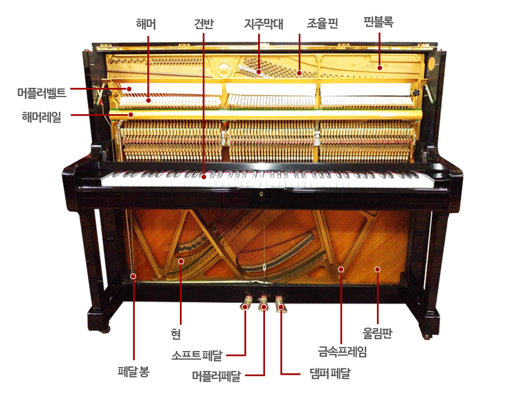
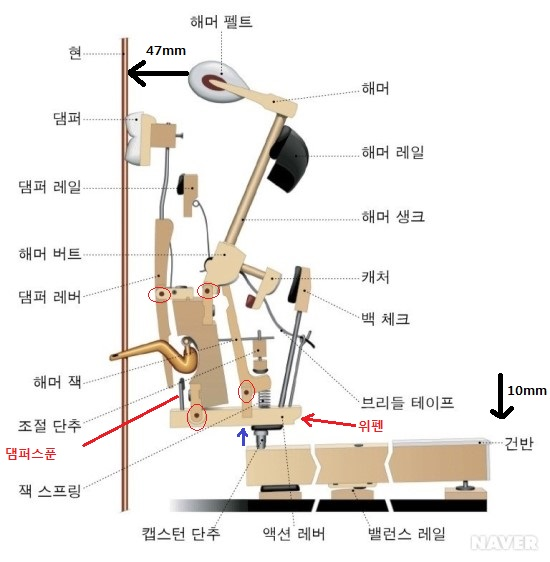
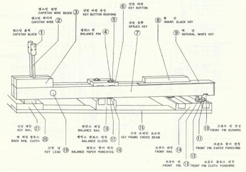

# 업라이트 피아노 구조
## 외부 구조
  - 
  1. 피목: 상부뚜껑 앞 나무
  2. 상판변죽: 상부 측면 나무
  3. 보면대: 책 놓는곳
  4. 장경첩: 건반 두껑 연결
  5. 건압대: 건반 압력 지지대
  6. 건반 보조목: 건반 앞 보조목
  7. 열쇠봉: 건반두껑 열쇠
  8. 옆판 보조목 하부 측면 보조목
  9. 하판: 아래 앞판, 열수 있음
  10. 토대목: 하부 아래 지지
  11. 캐스터: 바퀴에 달린 소음 줄이기(방음)
  12. 위뚜껑: 최상부 뚜껑
  13. 위판: 최상부 판
  14. 옆판: 측면 판
  15. 상판: 상부앞면 판
  16. 상판 띠목: 상부 하단 건반위쪽 띠로 생긴 판
  17. 반달목: 잠금장치와 걸리는 홈이 파진 나무
  18. 건반옆판: 건반 측면 판
  19. 건반두껑: 자세한 이야기는 생략한다.
  20. 건반대: 건반 아래 대
  21. 다리: 피아노 다리(누가봐도 다리처럼 생김)
  22. 발목: 발목처럼 생김
  23. 경첩: 보면대 경첩
  24. 건반두껑자호: ???
  25. 열쇠문: 건반 두껑 열쇠문
  26. 하판 손잡이: 하판을 움직일떄 잡아주는 손잡이
  27. 소프트페달
  28. 약음페달
  29. 댐퍼페달
  30. 밑판: 최하단 앞면 밑판

## 내부 구조
  - 
  1. 핀블록: 핀판
  2. 조율핀: 현을 조율할수 있는 핀
  3. 지주 막대: 상부 방음을 위한 막대
  4. 머플러펠트: 약음페달시 동작
  5. 해머: 현을 타격하는 도구
  6. 해머레일: 플렌지를 통해 연결
  7. 현: 피아노 발음원
  8. 페달봉: 페달을 밞았을때 움직이는 막대기
  9. 금속 프레임: 피아노를 지지 하는 철골
  10. 울림판: 울려야 소리가 난다.

## 액션
  - 
  1. 현
  2. 해머펠트: 양모로 만들어진 망치
  3. 해머: 펠트와 연결된 나무
  4. 해머레일: 해머의 정지 위치를 결정(타현겨리)
  5. 해머 생크: 해머의 목
  6. 캐처: 해머하부 옆으로 튀어나온 나무
  7. 백첵: 캐처를 잡아주는 역활(해머의 타격후 정지거리)
  8. 브라이들 테이프: 해머 되돌림 촉진 테이프
  9. 해머잭: 잭이 밀고 돌아오는 역활
  10. 잭스프링: 잭꼬리 밑에 달린 스프링(해머 되돌림)
  11. 위펜: 해머와 캡스턴을 연결해주는 역활
  12. 댐퍼스푼: 댐퍼를 띄워주는 숟가락
  13. 조절 단추: 댐퍼 스푼 조절
  14. 댐퍼레버: 댐퍼스푼이 닿는곳
  15. 댐퍼레일: 댐퍼 정지 하는 위치
  16. 댐퍼: 양모로 만들어진 현의 울림 조절 장치
  17. 캡스턴 버튼: 건반과 위펜사이에 들어주는 장치의 버튼
  18. 밸런스 레일: 밸러스핀 레일

## 건반
  - 
  1. 캡스턴 블록
  2. 캡스턴 와이어: 캡스턴 블록의 포지션 결정 
  3. 캡스턴 받침: 캡스턴의 토지
  4. 밸런스핀: 건반의 좌우 간격 조정(균형핀)
  5. 건반버튼
  6. 건반버튼붓싱: 마찰 방지(방음)
  7. 스프라이스키
  8. 흑건: 까만 건반
  9. 백건: 하얀 건반
  10. 프론트 핀 붓싱: 마찰 방지(방음)
  11. 프론트 종이 펀칭: 건반 높이 조절하는 종이
  12. 이름 없음
  13. 프론트 클로스 펀칭: 마찰 방지(방음)
  14. 프론트레일: 프론트를 연결하는 레일
  15. 건반 프레임 보조목
  16. 밸런스 종이 펀칭
  17. 밸런스 클로스 붓싱
  18. 밸런스 레일
  19. 건반납: 건반의 무게 중심 조정(납의 개수로 무게 조정가능)
  20. 백레일 클로스: 마찰방지 방음
  21. 건반레일: 건반을 연결하는 레일